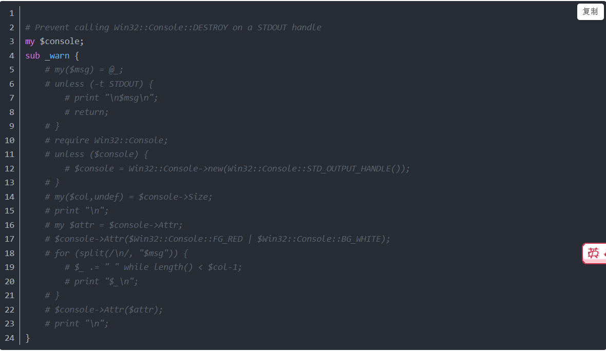

# telegram编译

# 一、openssl编译

（1）、you may need to install the Win32::Console module

D:\work\scm\cfet\openssl>perl Configure VC-WIN32 no-asm no-shared enable-tls1_3
--prefix="D:\work\scm\cfet\openssl\lib\x86"


会出现如下提示而无法继续。

Can't locate Win32/Console.pm in @INC (you may need to install the Win32::Console module) (@INC contains: C:\Perl64\site\lib C:\Perl64\lib) at C:\Perl64\lib/ActivePerl/Config.pm line 400.

解决办法，修改C:\Perl64\lib\ActivePerl\Config.pm，大约在400行左右：



Prevent calling Win32::Console::DESTROY on a STDOUT handle

`my $console;`
`sub _warn {`
    `# my($msg) = @_;`
    `# unless (-t STDOUT) {`
	`# print "\n$msg\n";`
	`# return;`
    `# }`
    `# require Win32::Console;`
    `# unless ($console) {`
	`# $console = Win32::Console->new(Win32::Console::STD_OUTPUT_HANDLE());`
    `# }`
    `# my($col,undef) = $console->Size;`
    `# print "\n";`
    `# my $attr = $console->Attr;`
    `# $console->Attr($Win32::Console::FG_RED | $Win32::Console::BG_WHITE);`
    `# for (split(/\n/, "$msg")) {`
	`# $_ .= " " while length() < $col-1;`
	`# print "$_\n";`
    `# }`
    `# $console->Attr($attr);`
    `# print "\n";`
`}`

# 二、编译qt

(1)、Configure ERROR in Qt 5.8.0 Win + VC2013 + SSL + OpenSSL

```
ERROR: Feature 'openssl' was enabled, but the pre-condition '!features.securetransport && tests.open
ssl' failed.

ERROR: Feature 'ssl' was enabled, but the pre-condition 'config.winrt || features.securetransport ||
 features.openssl' failed.

Check config.log for details.

Qmake failed, return code 3

 解决
 
 
Deleting the config.cache file solved it for me.

https://forum.qt.io/topic/77530/configure-error-in-qt-5-8-0-win-vc2013-ssl-openssl/22
```

# 三、git太慢

设置代理

如果要设置全局代理，可以依照这样设置

```text
git config --global http.proxy http://127.0.0.1:1080
git config --global https.proxy https://127.0.0.1:1080


git config --global --unset http.proxy
git config --global --unset https.proxy


git config --global http.postBuffer 524288000
这是个很有效的配置，修改后速度有质的提升
```


